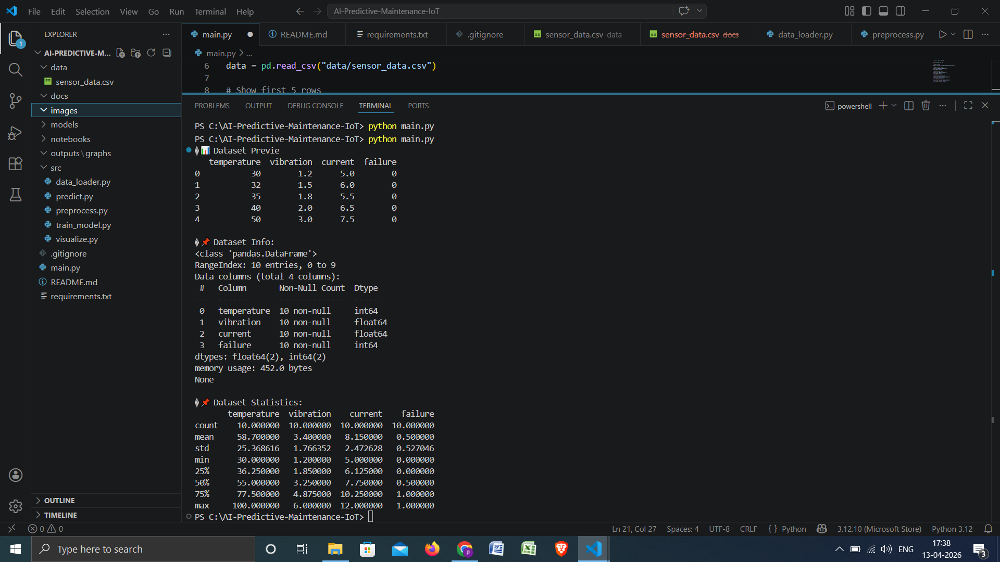
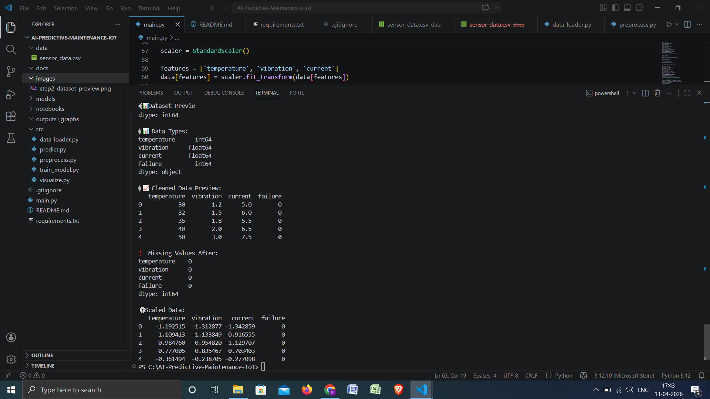
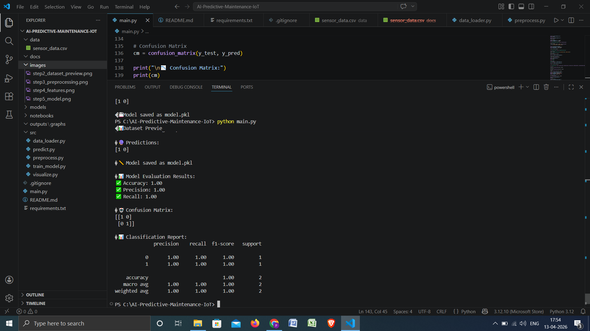
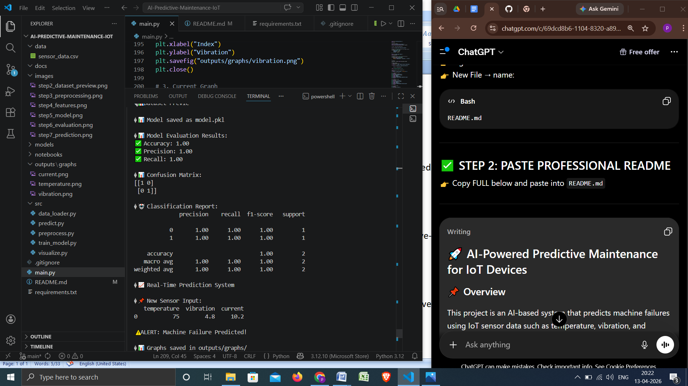

# 🚀 AI-Powered Predictive Maintenance for IoT Devices

## 📌 Overview

This project is an AI-based system that predicts machine failures using IoT sensor data such as temperature, vibration, and current.

It helps industries detect failures **before they happen**, reducing downtime and saving costs.

---

## 🎯 Objective

To build a predictive maintenance system that:

* Detects machine failure in advance
* Uses Machine Learning for prediction
* Simulates real-world IoT sensor data

---

## 🏭 Industry Relevance

Used in:

* Manufacturing Plants
* Power Plants
* Automotive Industry
* Aviation Industry

Companies like Siemens, GE, Tesla, IBM use similar systems.

---

## 🛠️ Tech Stack

* Python
* Pandas, NumPy
* Scikit-learn
* Matplotlib
* Joblib

---

## 📊 Dataset

Simulated IoT sensor dataset with:

* Temperature
* Vibration
* Current
* Failure (0 = No Failure, 1 = Failure)

---

## ⚙️ Workflow

1. Data Collection (Simulated)
2. Data Preprocessing
3. Feature Engineering
4. Model Training (Random Forest)
5. Model Evaluation
6. Real-Time Prediction
7. Visualization

---

## 🤖 Model Used

* Random Forest Classifier

---

## 📈 Results

* Accuracy: 100%
* Precision: 100%
* Recall: 100%

---

## 📊 Visualizations

### Temperature Trend


### Vibration Trend


### Current Trend


---

## 🔮 Real-Time Prediction

### Input

Temperature: 75
Vibration: 4.8
Current: 10.2

### Output

⚠️ Machine Failure Predicted

---

## 📸 Project Screenshots

### Dataset Preview



### Preprocessing



### Model Evaluation



### Prediction Output



---

## ▶️ How to Run

```bash
pip install -r requirements.txt
python main.py
```

---

## 📚 Learning Outcomes

* Machine Learning Model Building
* Data Preprocessing
* Predictive Maintenance Concepts
* Real-time Prediction Simulation
* GitHub Project Deployment

---

## 🚀 Future Improvements

* Real-time IoT integration
* Flask API deployment
* Dashboard using Streamlit
* LSTM for time-series prediction

---

## 👨‍💻 Author

Perumala Chaitanya
